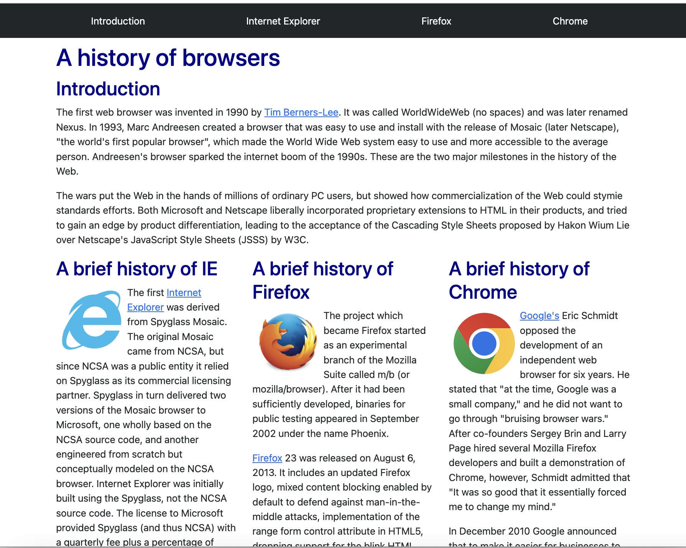
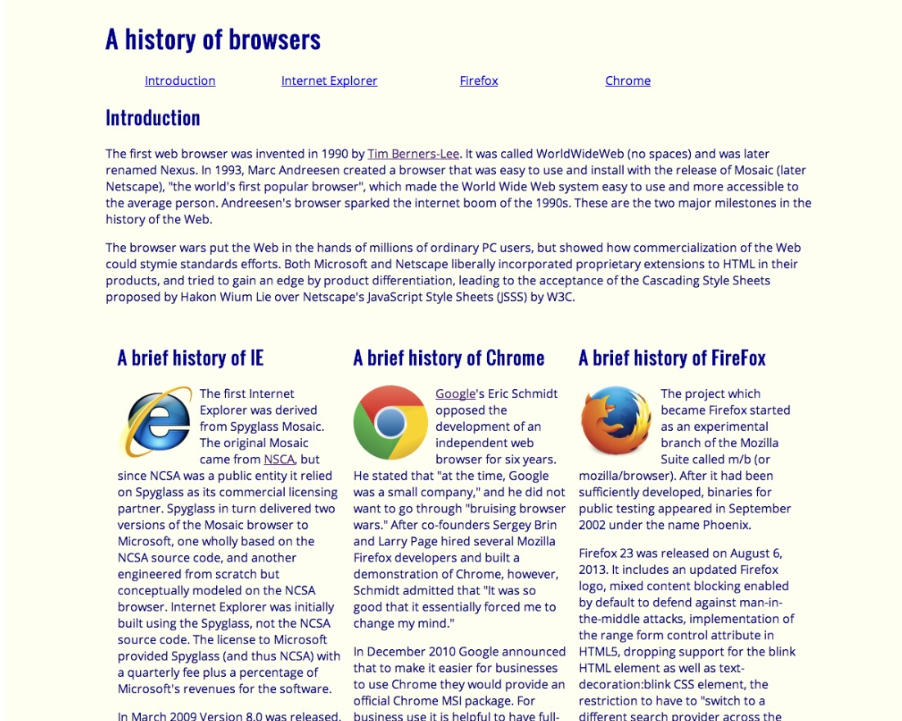

## UI Design: This is What I Want to Do. 

From my first computer science class up until now, the majority of what I learned in computer science was backend development. Honestly, I struggle with backend – for-loops, arrays, objects, algorithms etc. When the struggle outweighed the passion and curiosity, I questioned, “Is this really something I want to do in the future?” The new materials introduced to me never sparked any interest. I only learned for the sake of getting through the course.

However, in my software engineering class, the upcoming module was “UI Design (Basics)” which is learning how to design web pages using HTML and CSS. Admittedly, I felt for the first time inclined to learn more about a topic. For one of the assignments in the UI design module, I had to complete an introductory HTML and CSS course which is supposedly 5 hours long, but I didn't mind the 5 hours if I get to learn how to design a web page. 

## HTML & CSS : Canvas & Palette

After completing the introductory course, I compared UI designing with painting: HTML is the canvas and CSS is the palette. When the CSS “palette” is linked to the HTML “canvas,” a web page “painting” is created. It is not the best analogy, but that is how I picture the relationship between HTML and CSS. Overall, CSS is an essential for designing web pages.

## Too Slow & Tedious...

While working on the assignments using CSS, I noticed that creating customizations and alignments took a while for me, so I wondered, “Am I the problem? Do all web pages take this long to create?” For example, creating three columns of equal width involved implementing three different classes in the stylesheet for each column:

```
.left {
	float: left;
	width: 300px;
}

.right {
	float: right;
	width: 300px;
}

.center {
	margin-left: 300px;
	margin-right: 300px;
}
```
This process is disorganized, because I would have to memorize the column classes I created, and I would have to refer back to my stylesheet (I mainly used external CSS stylesheets) and constantly adjust or create a new column class with different margins. This is not the only tedious disadvantage; creating a navigation bar (navbar) is another example. I will not go into full detail with the navbar process but similar to columns, I implemented multiple classes in my stylesheet to design the layout of my navbar. 

## UI Frameworks: A New Lifesaver?

After learning the basics of UI design and going through the treacherous journey of creating stylesheets for different scenarios like 3-column layouts and navbars, I encountered a set of tools to lighten the weight of my journey, UI frameworks! UI frameworks are designed to relieve the workload and time of designing a web page by providing a ready-to-use CSS library. The first UI framework introduced to me is Bootstrap 5, which is one of the most widely and frequently used UI frameworks. 

## Bootstrap 5: Helpful yet Difficult

Initially, I thought everything in Bootstrap is simply copy and paste, however, Bootstrap and other UI frameworks involve learning how and when to utilize their tools. Similar to learning a new language, I had to research the functions of each component, layout, utilities, etc. Honestly, despite completing the Bootstrap crash course and reviewing the material, I had a much harder time learning how to implement Bootstrap than implementing my own CSS. Moreover, I thought, “Bootstrap is supposed to make my life easier but why am I struggling so much? Is the problem me again?”

Frustrated and confused, I continued to review and practice with Bootstrap. I admired Bootstrap’s navbar design the most, but I deeply struggled with the navbar – my nav-items did not align correctly, the spacing was off, I could not fit an image to size, etc. Once I got the hang of it, I started to enjoy and appreciate Bootstrap. For instance, referring back to columns, Bootstrap already has a built-in column feature -- “col” -- so no need to create a column design, yay! Moreover, I noticed how uniformed and “cleaner” my web page looked compared to not using any UI framework. 

The examples below demonstrate a web page with Bootstrap (left) and a web page without any UI framework (right). Both web pages have the same components such as the navbar and columns but let's take a look at the navbars. The navbar of the web page without UI framework clearly looks simpler than the navbar of the web page using Bootstrap. However, with my experience, creating the "simple" navbar took twice as long as creating the Bootstrap navbar, and the Bootstrap navbar offers more items and sections. 

<div class="text-center">


</div>

## But wait, there's more!

Bootstrap is indeed difficult due to the amount of content. However, once I got through the learning barrier, Bootstrap is a useful tool for UI design, saving a good deal of time and providing a “skeleton” of a web page. Before learning about Bootstrap, I noticed my CSS appeared to lack a few characteristics and structures of a web page, so Bootstrap introduced me to more interesting features such as inserting icons and customizing buttons. Bootstrap is one of many UI frameworks, so I am really curious on how the other UI frameworks function such as Semantic UI. I noticed that Bootstrap and Semantic UI are evenly biased, so it’s up to personal preference. After fully understanding Bootstrap, I hope to learn Semantic UI for my next UI framework. 