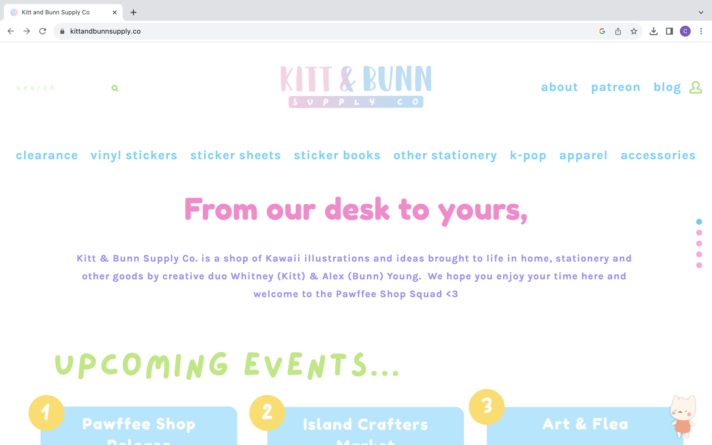
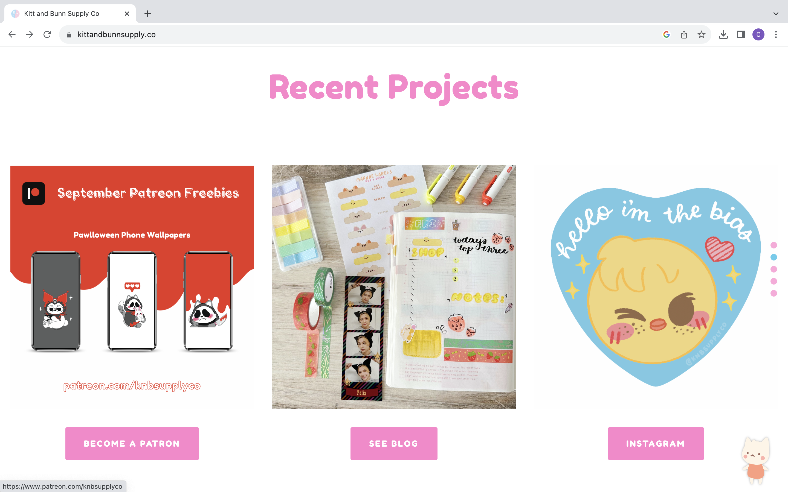
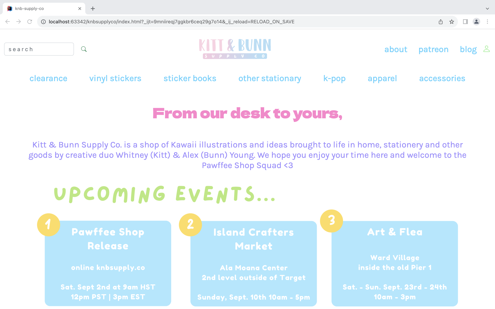
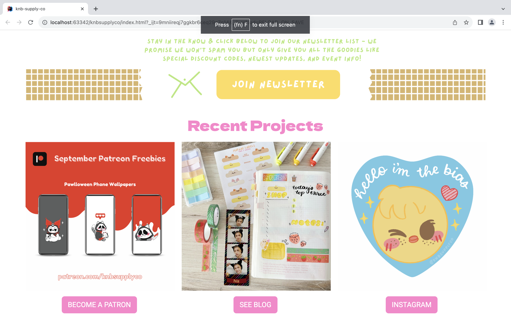

In ICS 314, I learned about UI design. More specifically, I learned how to use the HTML, CSS, and Bootstrap 5 framework to design usable, responsive, and attractive web pages. In a series of experiences, I was guided through how to rebuild a web page using Bootstrap 5 so with that knowledge, I recreated a site of my choosing. The website I chose to recreate was my friend’s small business, [Kitt & Bunn Supply Co.](https://www.kittandbunnsupply.co/)

## Actual Webpage

  

    
  

  

    
  

My prior experiences involved mimicking an image of a website page without the link to the website, so I struggled with identifying the right components and functions to use. By recreating a website of my choice, I learned how to use the Chrome developer tools as a helper for the layout of the webpage. Moreover, I learned how to implement a navbar using Bootstrap and without any CSS, and I learned how to utilize the row and column components to format my webpage. 

## Recreation

  

    
  

  

    
  

Overall, my experience of learning Bootstrap was challenging yet helpful, further explained in my [essay]( https://cjochim.github.io/essays/ui-design-frameworks.html) on UI design frameworks. I did not mimic the website perfectly, but I copied the website the best I could utilizing Bootstrap, and, in my opinion, it looks great! Because I enjoyed working on this experience, I realized that I am interested in front-end development and UI design. 
