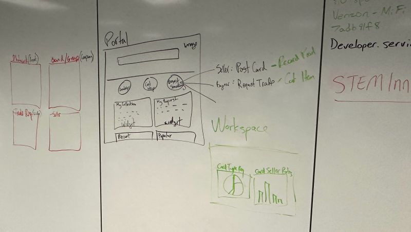
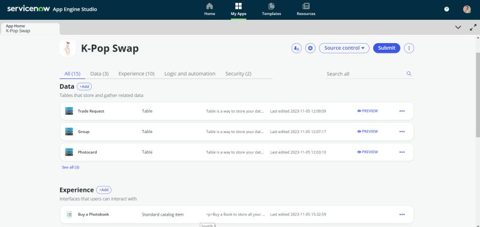
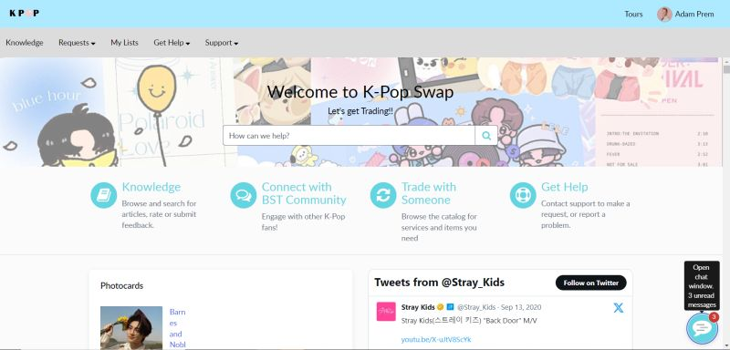
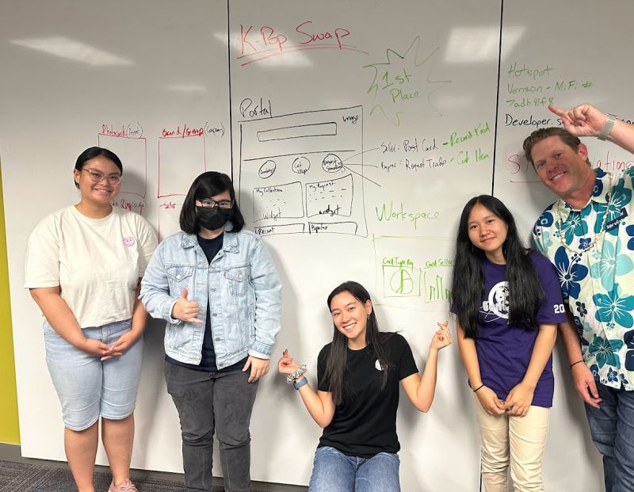

I spent a few days at the AFCEA Hawaii TechNet Indo-Pacific STEM workshop hosted by ServiceNow. ServiceNow is a software company that “offers solutions for IT service and operations management, the employee and customer experiences, low-code and hyper-automation, and a whole lot more—all built on a single, unifying platform that eliminates silos.” Despite having no knowledge of ServiceNow, I learned how to implement an application using low-code to no-code software. At the end of the workshop, the goal was to build a no-code application utilizing ServiceNow’s App Engine. I collaborated with three other people in the workshop and a mentor who works at ServiceNow. 

  

    
  

  

    
  

Since we could create any application, I pitched an idea. Are you familiar with baseball or Pokémon cards? If not, people collect, buy, sell, and trade these cards. Similar to baseball and Pokémon cards, K-Pop photocards are also collected, bought, sold, and traded. I also buy, sell, and trade (BST) K-Pop photocards on Instagram. Moreover, the BST community on Instagram is surprisingly large. However, BST on Instagram can get disorganized and overwhelming; most times, I have a hard time trading my cards and finding the cards I want. I thought about creating an app for the BST community for a while, and I thought this workshop would be a great opportunity. As a result, my group members liked my idea, and we worked on an app called K-Pop Swap. 

Unfortunately, I do not have the link and code to the app – I asked my mentor, but I have not received a response at the moment. Due to limited time, we could only implement the trading function where the user can search, request a trade, and post a trade for a photocard. These functions did not require code, shocking right? I noticed that the App Engine is similar to Bootstrap, where there are functions created and I use those functions as a template or tool. My group and I utilized these functions and inputted the functions into a “workflow” to implement the app. 

At the end of the workshop, each group had to present their app, and the best app was voted for. I presented my group’s app, and everyone enjoyed the presentation! As a result, my group’s app was voted 1st place by our peers. This workshop was my first experience in a work collaboration environment. I enjoyed working with peers around my age and level of knowledge and with adults in the IT field. 
