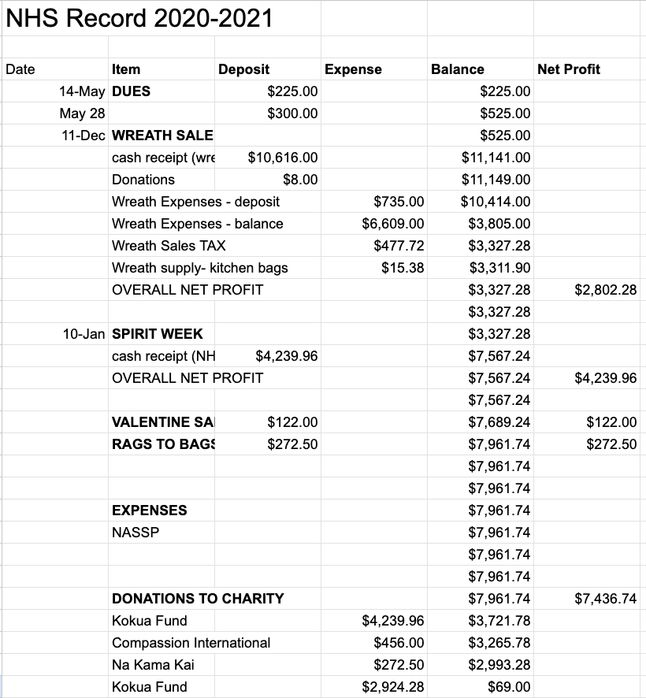

  

I was treasurer in the National Honors Society (NHS) council, and I supervised and participated in the fundraising committee. During the school year of 2020-2021, the NHS hosted a number of fundraisers. My job was to bookkeep all of the deposits and expenses from each fundraiser. At that time, I was not familiar with excel sheets, so this project taught me how to use a few functions / shortcuts in excel. Moreover, it was an interesting experience to analyze how school fundraisers work behind the scenes. 

## Wreath Charity Fundraiser
During the Christmas season, we hosted a Wreath Charity Fundraiser. We encouraged NHS members, students, teachers, and many people outside of school to purchase wreaths. The fundraiser was during the time of COVID-19, so it was difficult to persuade people to buy wreaths due to the restrictions. Since many families were struggling financially, the fundraising committee and NHS council agreed to donate the proceeds to the families in need for financial assistance. As a result, we collected $2,802.28. After selling the wreaths, I was in charge of obtaining cash receipts and documenting the payments on my school's fundraising excel sheet. 

