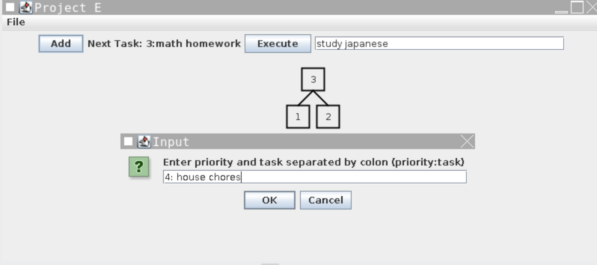

  

The concept of a priority queue is to input items with the highest priority to the end of the queue. The highest priority item will be the first to dequeue, then the next highest priority and so on. The goal of the project is to create a priority queue of tasks with different priorities. 

To implement the priority queue, I used Heapsort methods. When the program is running, the first task will be inputted with the priority displayed -- 1 as least priority. The next tasks will be inputted in a tree-like fashion. The task of highest priority will be displayed until executed. 
