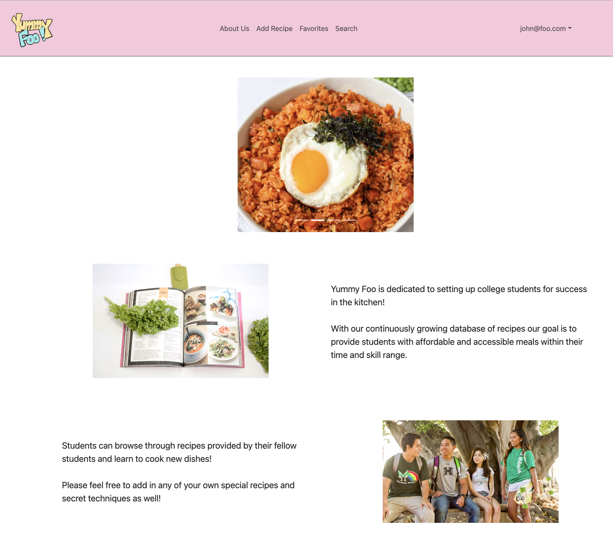
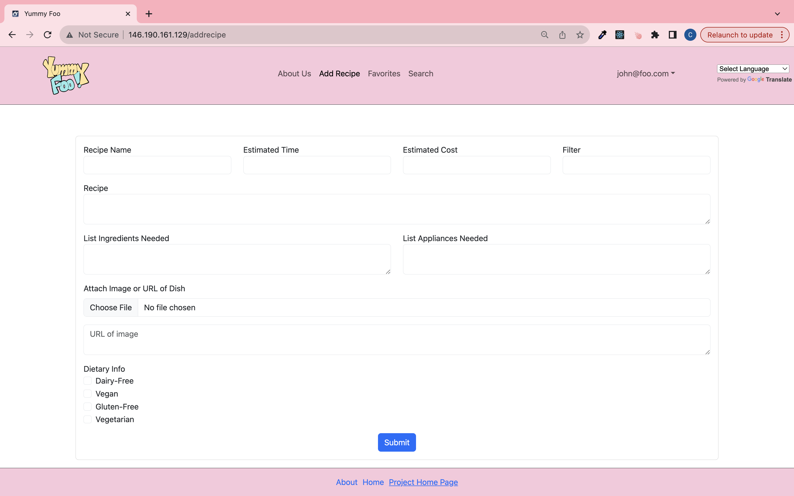

For my ICS 314 final project, I collaborated with three classmates, and we developed an application called Yummy Foo. The goal of Yummy Foo is to create an information hub for UH Manoa students where they can find, share, and learn recipes that will fit within the budget and convenience of a college student. The outcome of the project demonstrated my capability of utilizing IntelliJ IDEA, basic JavaScript, configuration management tools and techniques, HTML and CSS, and Meteor Framework. In addition, because Yummy Foo was my first group project, I experienced collaborating efficiently in a team.

Despite everyone in the group having different strengths, whether in JavaScript, HTML, Bootstrap, etc., all the work in the project was divided evenly. My main contribution was implementing the add recipe form that will submit the recipe name, estimated time & cost, instructions, list of ingredients & appliances, image of the recipe, and dietary information to the system. Although the goal of the project is to infuse the concepts learned in class, I learned new functions and concepts from the web and teammates throughout the project. For example, I did not know how to store the checkbox form values in the database and call the submitted values back to the posted recipe, but I utilized ChatGPT and learned how. In class, we briefly went through how to test our application with TestCafe, so I learned with the aid of ChatGPT how to test the add recipe form. In addition to the add recipe form, I helped link the pages. For example, when the user clicks on the logo in the navbar, the user is directed back to the home page.

Overall, I had a great experience with Yummy Foo. This project required a range of knowledge from front-end to back-end and the user’s experience. Admittedly, I struggled with back-end development and coding in JavaScript, but my group members were knowledgeable about the back-end material. Despite my lack of skill, I did not refrain from the back-end stuff and instead, I learned from my teammates. Initially, I was shy to ask for help, but I began to open up when I realized that we all have the same goal, so we need to help one another. At the end of the project, I was impressed by what I can create with the knowledge I have now and what I can create with the knowledge I will learn in the future.
